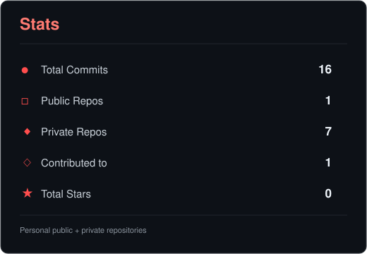

  
  

  

I'm a full stack developer. I work on the development and maintenance of web applications, APIs, databases and automation.

My experience includes Vue.js, JavaScript, Java, PHP, SQL, Docker, Git and GitLab, as well as React, TypeScript, C#, .NET, PostgreSQL, GitHub Actions and Nginx. I like understanding the whole system, from the interface and business rules to databases, integrations and deployment.

I also work on systems that use geographic data. In this area, I work with PostGIS, GDAL, Leaflet, WebGIS, geoprocessing and georeferencing.

 

 

  
  
  
  
  
  
  

  
  
  
  
  
  

  
  
  
  
  
  

 

 

Alongside web development, I also work on applications that use spatial data, interactive maps and georeferenced information.

  
  
  
  
  
  

  

 

 

  <picture>
    <source media="(prefers-color-scheme: dark)" srcset="./profile/contribution-snake-dark.svg">
    <source media="(prefers-color-scheme: light)" srcset="./profile/contribution-snake.svg">
    
  </picture>

 

  
  

 

  

 

 

  
  
  
  
  
  
  
  
  

