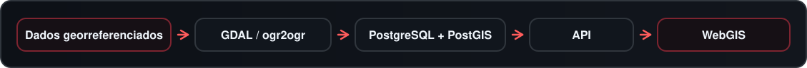
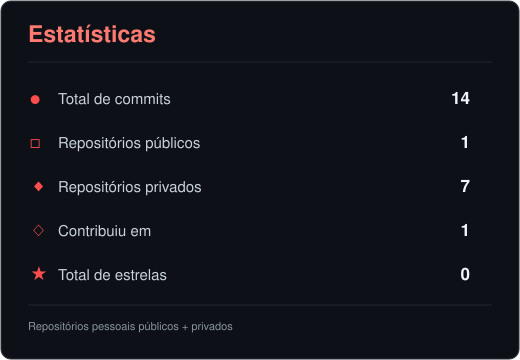

  
  

  

Sou desenvolvedor full stack. Trabalho no desenvolvimento e manutenção de aplicações web, APIs, bancos de dados e automações.

Tenho experiência com Vue.js, JavaScript, Java, PHP, SQL, Docker, Git e GitLab, além de atuar com React, TypeScript, C#, .NET, PostgreSQL, GitHub Actions e Nginx. Gosto de entender o sistema de ponta a ponta, da interface e das regras de negócio até banco, integração e deploy.

Também trabalho com sistemas que usam dados geográficos. Nessa área, atuo com PostGIS, GDAL, Leaflet, WebGIS, geoprocessamento e georreferenciamento.

 

 

  
  
  
  
  
  
  

  
  
  
  
  
  

  
  
  
  
  
  

 

 

Além do desenvolvimento web, também atuo em aplicações que usam dados espaciais, mapas interativos e informações georreferenciadas.

  
  
  
  
  
  

  

 

 

  <picture>
    <source media="(prefers-color-scheme: dark)" srcset="./profile/contribution-snake-dark.svg">
    <source media="(prefers-color-scheme: light)" srcset="./profile/contribution-snake.svg">
    
  </picture>

 

  
  

 

  

 

 

  
  
  
  
  
  
  
  
  

